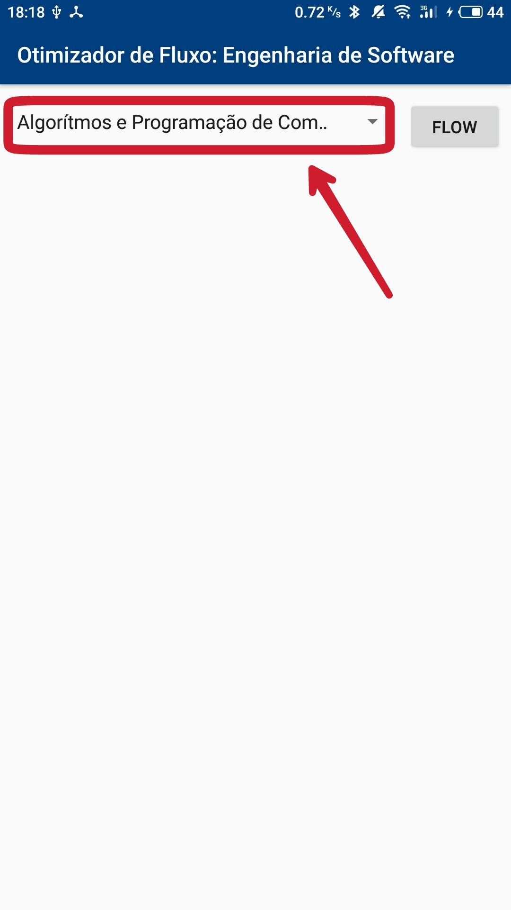
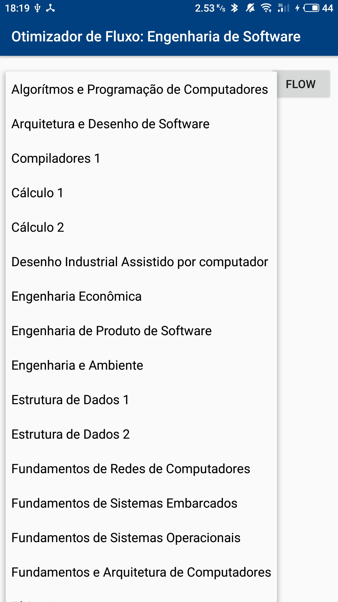
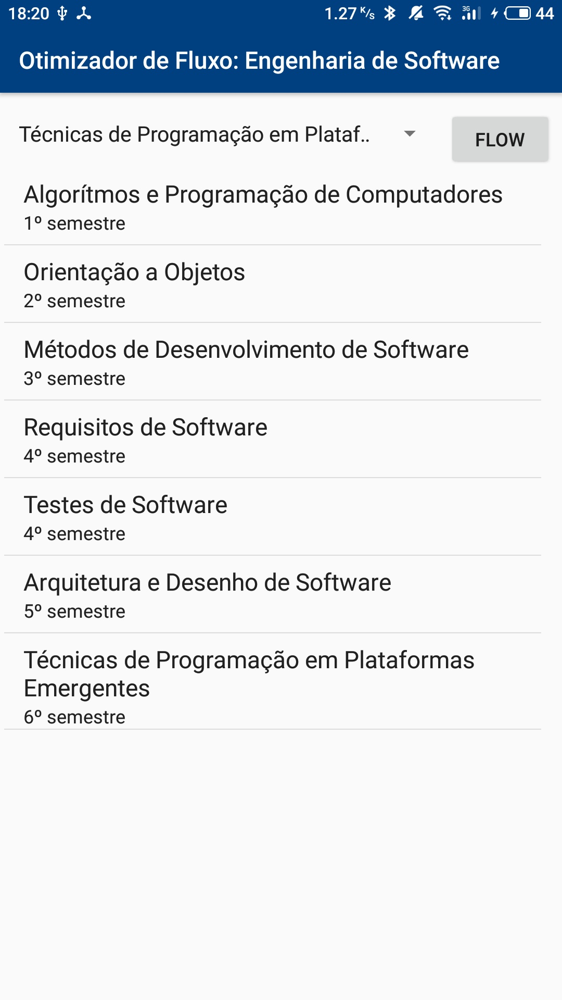
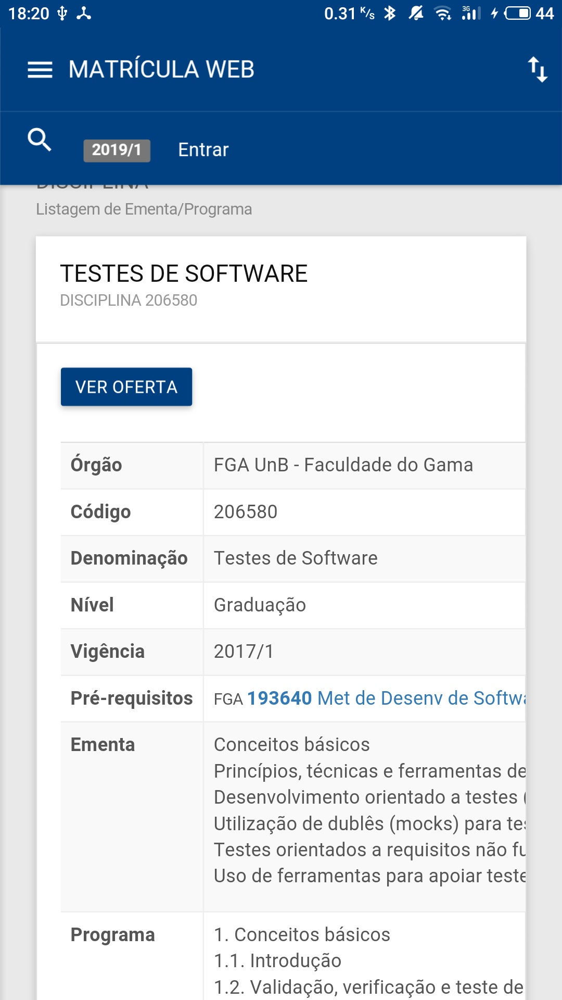
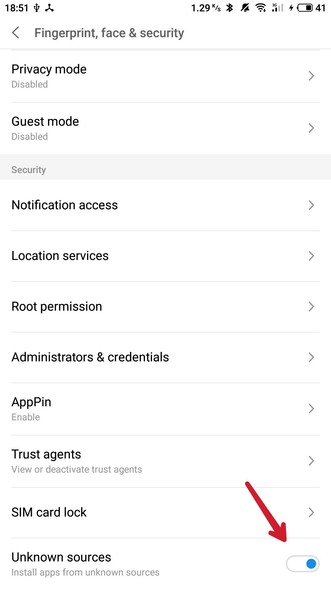
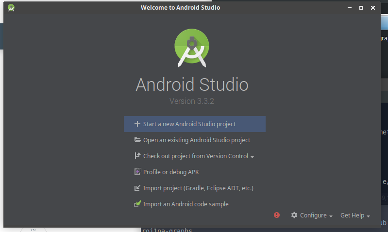
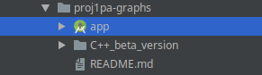
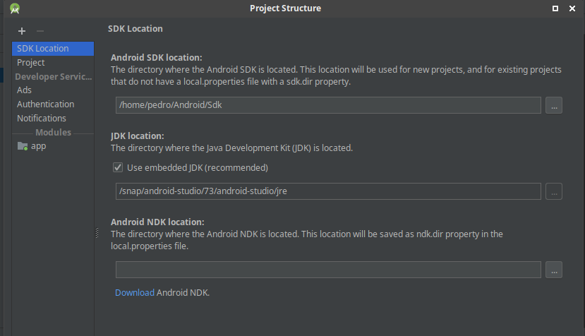
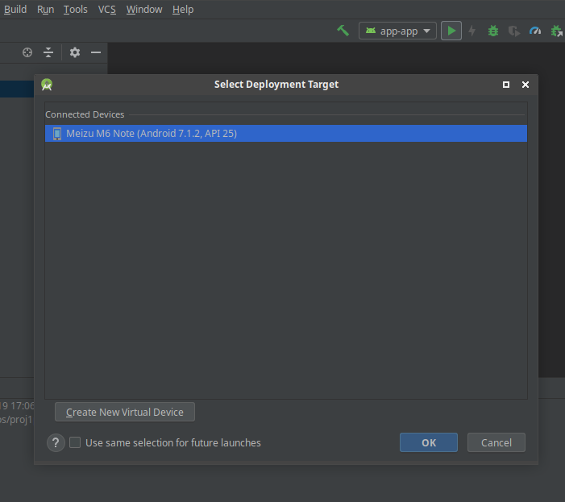

# App: Otimizador do Fluxo do Curso de Engenharia de Software da UnB - FGA

O app foi desenvolvido como um projeto para a disciplina do 6º semestre de Engenharia de Software da Universidade de Brasília de acordo com o fluxo atual, Projeto de Algorítmos.

O intuito é mapear todo o fluxo como um grafo, e utilizando o algorítmo de busca em largura (BFS - breadth-first search), encontrar o menor caminho para determinada disciplina. Desta forma, é possível cursar todas as matérias obrigatórias no menor período de tempo. 

## Funcionalidades:

Você pode escolher uma matéria clicando na caixa de seleção. Será aberta a lista de matérias obrigatórias, selecione a matéria desejada e pressione o botão FLOW. Será gerada uma lista de opções com o nome das matérias pré-requisitos da matéria selecionada e o semestre mais otimizado possível. Selecionando uma das matérias da nova lista gerada, será aberta uma versão "mobile" do Matrícula Web mostrando mais informações sobre a matéria assim como ementa, outros possíveis pré-requisitos além da oferta no semestre recorrente. É possível até mesmo logar em sua conta e fazer a matrícula diretamente pelo app.

Imagens reais do aplicativo. Fonte própria.

## Requisitos:
Caso queira visualizar o código, fazer alterações e executar:
- Ter a versão mais recente da IDE da Google para Android: [Android Studio](http://developer.android.com/studio)

Caso queira apenas instalar em seu dispositivo o apk:
- Baixar a última versão do apk [AQUI](https://raw.githubusercontent.com/pedroeagle/App-PA/master/APK/OtimizadorDeFluxoEngSoftware-v1.0.apk).

Para ambos os casos:
- Um dispositivo ou emulador com android 4.4 ou superior. (Foi testado apenas no Android 7.1.2 e o 8.0)
- Uma conexão com a internet

## Executando o apk (caso você só queira instalar o app)
- Vá nas configurações de segurança do seu dispositivo e deixe a opção de "instalar apps de fontes desconhecidas" marcada.
  

- Baixe o apk [AQUI](https://raw.githubusercontent.com/pedroeagle/App-PA/master/APK/OtimizadorDeFluxoEngSoftware-v1.0.apk).
- Com um gerenciador de arquivos procure pelo aquivo .apk, selecione e instale.

## Executando o código fonte no Android Studio

Clone o repositório em seu computador

    git clone https://github.com/projeto-de-algoritmos/proj1pa-graphs

Abra o Android Studio e clique em "Open an existing Android Studio project"

Procure pelo pasta do repositório clonado e selecione o diretório "app"

Pressione Ctrl+Alt+Shift+S para visualizar a estrutura do projeto. Caso o endereço mostrado no Android SDK Location não esteja certo, corrija e logo após clique em Ok.

Clique no ícone verde com o símbolo play. Selecione o dispositivo o qual será instalado o aplicativo e clique em Ok. O app será iniciado automaticamente no dispositivo ou emulador utilizado.

## Possíveis bugs

O código de algumas matérias pode estar desatualizado fazendo com que não seja encontrada a página da matéria no Matrícula Web.